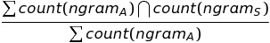

## Plagiarism Detection on AWS

In this project, the task is to build a plagiarism detector that examines a text file and performs binary classification; labeling that file as either plagiarized or not, depending on how similar that text file is to a provided source text.

### Defining Features
One of the ways to go about detecting plagiarism, is by computing similarity features that measure how similar a given text file is as compared to an original source text. This can develop as many features as needed and require defining a couple as outlined in this [paper](https://s3.amazonaws.com/video.udacity-data.com/topher/2019/January/5c412841_developing-a-corpus-of-plagiarised-short-answers/developing-a-corpus-of-plagiarised-short-answers.pdf) (which is also linked in the Lesson Resources tab. In this paper, researchers created features called containment and longest common subsequence.

I have defined a few different similarity features to compare the two texts. Once the relevant features are extracted, a LinearSVC model is used to perform classification.

### Containment

One of the first tasks is to create containment features that first look at a whole body of text (and count up the occurrences of words in several text files) and then compare a submitted and source text, relative to the traits of the whole body of text.

Count vectorization calculates n-gram counts and then follow the formula for containment:

If the two texts have no n-grams in common, the containment will be 0, but if all their n-grams intersect then the containment will be 1. Intuitively, it can be seen how having longer n-gram's in common, might be an indication of cut-and-paste plagiarism.

